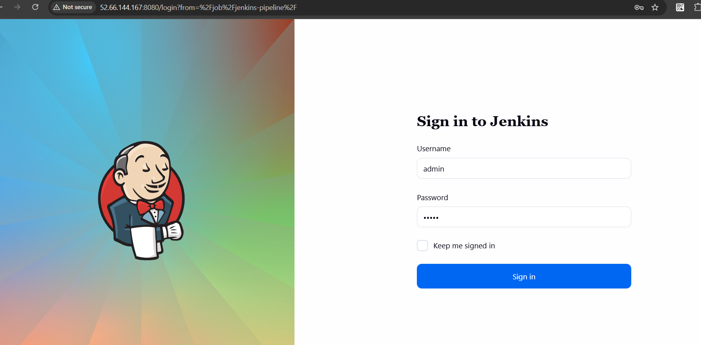
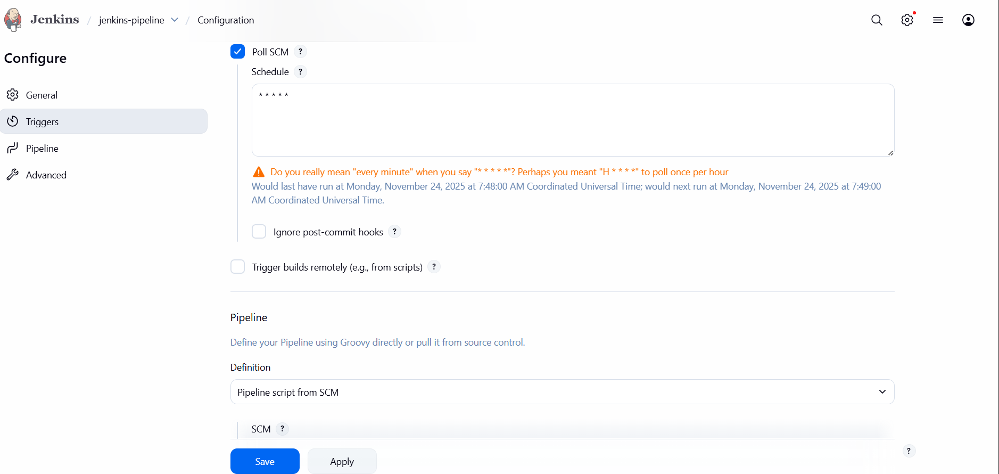
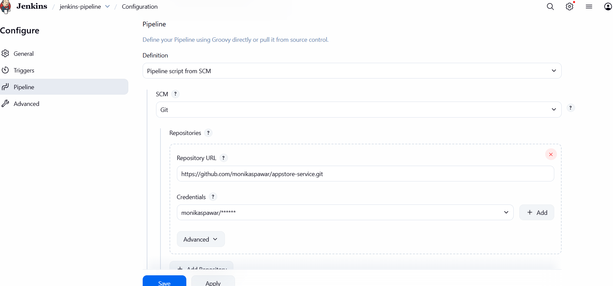

# Automated Code Testing and Deployment Pipeline

## Project Overview

One of the most common and widely used Jenkins server setups is for code testing and build deployments. With this project, you will learn how to configure a Jenkins pipeline that triggers automatically whenever developers push code to the version control repository. Jenkins is responsible for running test cases, and if those test cases pass, deploying the build to staging or production servers.

## Step-by-Step Guidelines

1. **Install Jenkins** on your local machine or server.
2. **Integrate version control tools** such as Git with your Jenkins server.
3. **Write a script** that triggers whenever a code push happens.
4. **Integrate testing frameworks** such as JUnit for running automated test cases.
5. **Deploy applications** to servers such as AWS or platforms like Playstore and Appstore.

## Screenshots
Create EC2 instance.

Add ports 8080 (Jenkins UI), 22 (SSH) and 8085 (application port) in security group.

ssh -i your-key.pem ec2-user@your-server-ip

installation-setup.sh

This script automates the complete setup of a Jenkins CI server on an AWS EC2 instance. It installs all required dependencies for Continuous Integration and Deployment, including Java, Maven, Git, Jenkins, SSH client, and generates SSH keys for secure deployments to the application server.

Open your pipeline job

🚀 Run the complete CI/CD Pipeline in Jenkins

Open your app in browser:

